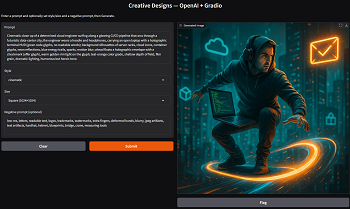

# ai-projects
A curated index of my AI demos, course builds, and showcase apps. Each project is production-minded (Dockerized, documented) so others can run them quickly.

> 🧭 Quick start: each card links to its repo with a `docker compose up` flow.

---

## Projects

### 1) Creative Designs — OpenAI + Gradio
Turn text prompts into campaign-ready images with a simple Gradio UI.
- **Stack:** Python, Gradio, OpenAI API, Docker
- **Repo:** [creative-design](https://github.com/l8knightz/creative-design)
- **Highlights:** Style presets, multiple canvas sizes, clean container workflow
- **Screenshot:**  
  

**Run (from the project repo)**
```bash
git clone https://github.com/l8knightz/creative-design.git
cd creative-design
cp env.example .env   # add your OPENAI_API_KEY
docker compose up --build
# open http://localhost:7860
```

### 2) HR Chatbot — RAG + Gradio
Conversational chatbot that answers questions grounded in PDF documents using:
- **Stack:** Python, Gradio, OpenAI API, Chroma, Docker
- **Repo:** [hr-chatbot](https://github.com/l8knightz/hr-chatbot) 
- **Ingestion:** PyPDFLoader + RecursiveCharacterTextSplitter
- **Vector DB:** Chroma + OpenAI Embeddings
- **LLM:** GPT-3.5-Turbo via LangChain’s ChatOpenAI
- **UI:** Gradio ChatInterface

**Run (from the project repo)**
```bash
git clone https://github.com/l8knightz/hr-chatbot.git
cd hr-chatbot
cp env.example .env   # add your OPENAI_API_KEY
docker compose up --build
# open http://localhost:7860
```
